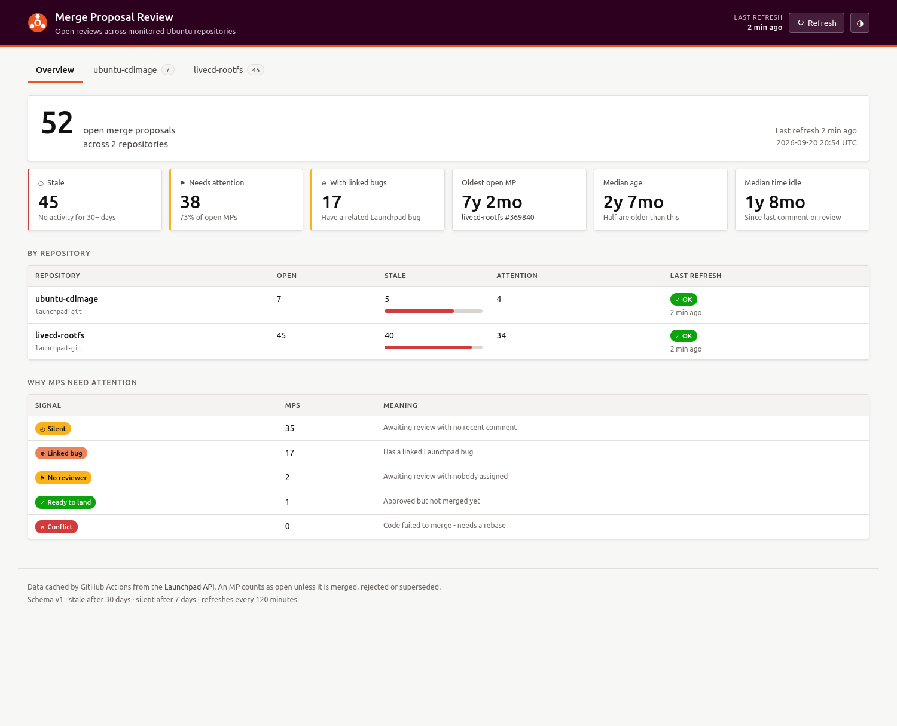
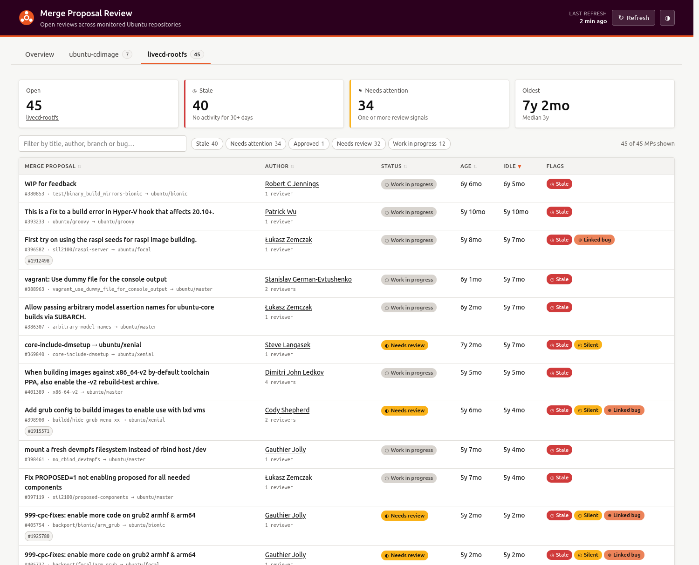

# Ubuntu MP Review Dashboard

A small, static dashboard showing every **open merge proposal** across a
configured set of Ubuntu repositories — what is stale, what needs attention, and
who owns it. Hosted on GitHub Pages, refreshed by GitHub Actions.



<details><summary>Per-project tab</summary>



</details>

---

## Why it is built this way

**Launchpad's API cannot be called from the browser.** `api.launchpad.net`
returns no `Access-Control-Allow-Origin` header and answers `OPTIONS` preflight
with `405`, so a page on GitHub Pages cannot fetch it directly — verified, not
assumed. The architecture follows from that:

```
GitHub Actions (every 2h)              GitHub Pages (static)
  scripts/fetch.py                       docs/index.html
    └─ scripts/providers/launchpad.py      └─ docs/assets/app.js
         │                                        ▲
         └── writes ──▶ docs/data/dashboard.json ─┘  (committed to git)
```

The fetcher normalises each provider's API into one schema. **The UI never sees
a provider's field names**, which is what lets a GitHub pull-request provider
drop in later without touching the front end.

Committing the data file is deliberate: it is what makes graceful degradation
possible. When a repository fails to refresh, its previously cached merge
proposals are carried forward and the UI shows them alongside the timestamp of
the last refresh that actually succeeded.

No build step, no bundler, no runtime JavaScript dependencies.

---

## Quick start

```bash
git clone <your fork> && cd auto-mp-reviewer
pip install -r requirements.txt

python scripts/fetch.py                 # writes docs/data/dashboard.json
python -m http.server 8000 --directory docs
# open http://localhost:8000
```

### Fetcher options

| Command | Purpose |
|---|---|
| `python scripts/fetch.py` | Refresh every configured repository |
| `--repo livecd-rootfs` | Only this repo (repeatable). Untouched repos keep their cached data |
| `--no-bugs` | Skip the linked-bug lookups |
| `--dry-run` | Print a summary, write nothing |
| `--out PATH` / `--config PATH` | Override the data file or config location |
| `-v` | Show per-request retry detail |

A full refresh of the two default repositories takes roughly **two minutes**.

---

## Configuration

Everything lives in [`config/repos.yaml`](config/repos.yaml). Project tabs are
generated from this file — nothing about them is hard-coded in the UI.

```yaml
defaults:
  stale_after_days: 30          # no activity for this long -> STALE
  silent_after_days: 7          # needs-review + no comment this long -> attention
  refresh_interval_minutes: 120 # UI poll interval; keep the workflow cron in step
  fetch_linked_bugs: true       # set false if refresh runs get slow
  max_workers: 8

repositories:
  - id: livecd-rootfs
    name: livecd-rootfs
    provider: launchpad-git
    namespace: "~ubuntu-core-dev"   # Launchpad owner
    project: livecd-rootfs
    repository: livecd-rootfs
```

`namespace`, `project` and `repository` combine into the Launchpad API path
`{namespace}/{project}/+git/{repository}`.

Changing `refresh_interval_minutes` also means updating the `cron:` line in
[`.github/workflows/refresh.yml`](.github/workflows/refresh.yml) — the config
value drives the UI, the cron drives the fetch.

### What counts as open

An MP is open unless it is **merged, rejected or superseded**. Superseded MPs
have been replaced by a successor and are dead, so they are excluded even though
they are literally neither merged nor rejected — including them would have added
31 dead proposals to `livecd-rootfs` alone.

Concretely: `Work in progress`, `Needs review`, `Approved`,
`Code failed to merge`, `Queued`.

### What counts as needing attention

| Signal | Meaning |
|---|---|
| **No reviewer** | `Needs review` with nobody assigned |
| **Ready to land** | `Approved` but still open |
| **Silent** | `Needs review` with no comment for `silent_after_days` |
| **Conflict** | `Code failed to merge` — needs a rebase |
| **Linked bug** | Has a related Launchpad bug |

**Stale** is separate and measured from *last activity*, not creation: an MP
with no comment, review vote or status change for `stale_after_days`. A
six-month-old MP reviewed yesterday is not stale; a three-week-old MP nobody has
touched is on its way to being.

> The UI keeps two ideas strictly apart: an **MP is stale** when nobody has
> touched it, and **the data is out of date** when the Action has not run. They
> are different problems and never share a word.

---

## Deployment

1. Push this repository to GitHub.
2. **Settings → Pages → Source: Deploy from a branch**, branch `main`,
   folder **`/docs`**.
3. **Settings → Actions → General → Workflow permissions**: allow
   *Read and write permissions* (the workflow commits the refreshed data).
4. Run **Actions → Refresh merge proposal data → Run workflow** once to populate
   `docs/data/dashboard.json`.

The workflow runs every two hours, on manual dispatch, and whenever the config
or fetcher changes. It skips the commit when nothing changed, and it succeeds
even if individual repositories fail — that state is data the dashboard renders,
not a broken build.

> GitHub disables scheduled workflows in repositories with no activity for 60
> days. If the dashboard's "out of date" banner appears, check that first.

---

## Adding a provider

The abstraction lives in [`scripts/providers/base.py`](scripts/providers/base.py)
and carries no provider-specific knowledge. Staleness and attention rules are
computed there, not per provider, so every provider inherits identical
semantics.

1. Subclass `Provider`, implementing `fetch(repo_cfg) -> list[MergeRequest]`
   and `repo_url(repo_cfg)`.
2. Map the provider's own status strings onto the shared vocabulary
   (`needs_review`, `in_progress`, `approved`, `conflict`, `queued`).
   Keep the original wording in `status` for display.
3. Register it in [`scripts/providers/__init__.py`](scripts/providers/__init__.py).
4. Add repositories using it to `config/repos.yaml`.

Raise `ProviderError` for a whole-repository failure; degrade quietly for
per-MP detail you cannot retrieve, so one missing field never drops an MP.

[`scripts/providers/github.py`](scripts/providers/github.py) is a deliberate
stub showing the shape.

---

## Launchpad API notes

Verified against the live API — useful if you extend the provider.

| Topic | Detail |
|---|---|
| Listing open MPs | `GET {repo}?ws.op=getMergeProposals&status=...` repeated per status. The `landing_candidates` collection returns an identical set but has pathological cold-cache latency (measured at 120s and 270s for a 7-entry response). |
| Auth | None needed for any call used here. |
| Linked bugs | `{mp}?ws.op=getRelatedBugTasks`. The obvious `{mp}/bugs` collection returns **HTTP 401** for anonymous callers. |
| Author names | The MP carries only `registrant_link`; resolving it gives `display_name`. Memoised per run. |
| Last updated | **No such field exists on an MP.** It is derived from `date_created`, `date_review_requested`, `date_reviewed`, the newest comment and the newest review vote. |
| Reviewer votes | Available from `{mp}/all_comments` (`vote`, `vote_tag`) — no extra request needed. |
| Sporadic stalls | An endpoint answering in 0.2s will occasionally hang ~271s. The provider uses a short read timeout and retries rather than waiting it out. |

---

## Phase 2 — LLM review (not implemented)

The architecture leaves a seam, and nothing more:

- every `MergeRequest` carries `review: null`, reserved for a review result;
- `diff_url` is already captured from Launchpad's `preview_diff_link`, so a
  review harness has the diff without re-crawling;
- a future `scripts/reviewers/` registry would mirror `scripts/providers/`:
  one module per model or harness, selected from config, writing into `review`.

The UI reads a normalised schema, so surfacing a review means rendering one more
field — not reshaping the data model.

---

## Layout

```
config/repos.yaml               repositories + thresholds
scripts/fetch.py                CLI entrypoint, merges with cached data
scripts/providers/base.py       normalised model + staleness/attention rules
scripts/providers/launchpad.py  Launchpad git provider
scripts/providers/github.py     stub
docs/index.html                 GitHub Pages root
docs/assets/{styles.css,app.js} UI, no build step
docs/data/dashboard.json        generated, committed
.github/workflows/refresh.yml   cron + manual dispatch
```
