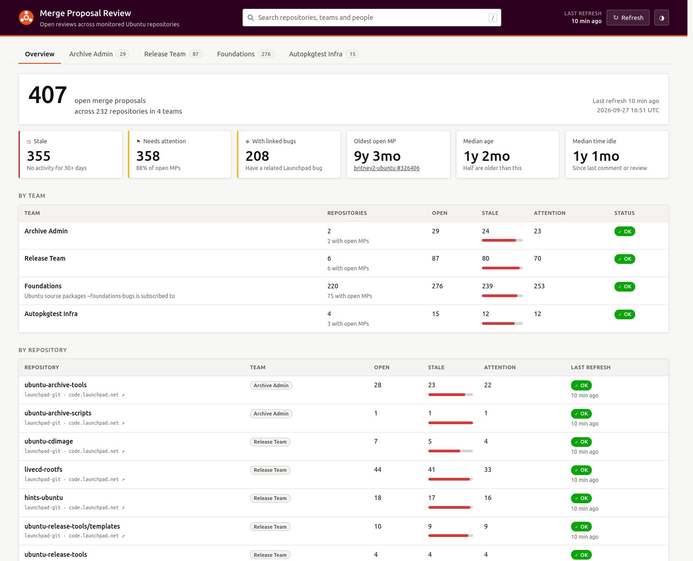
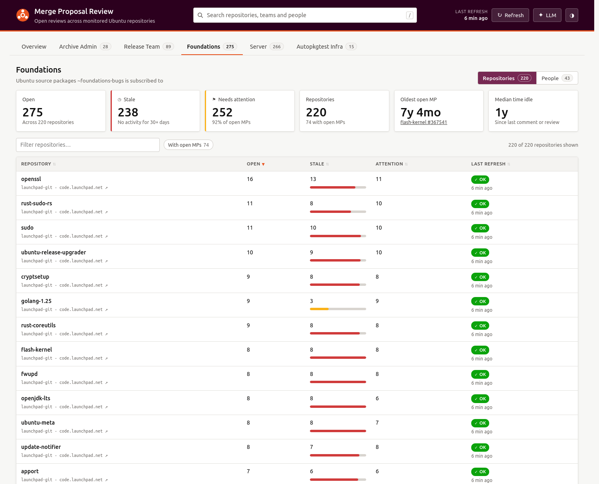
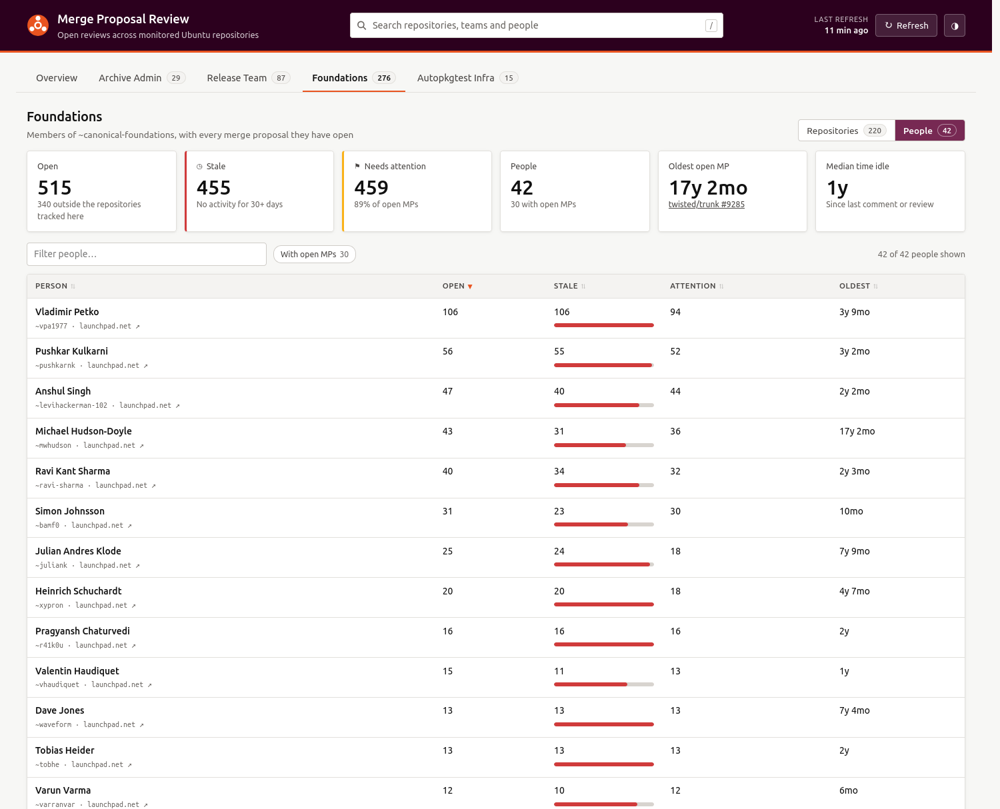
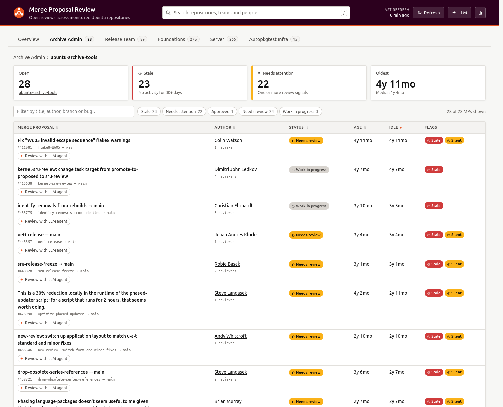

# Ubuntu MP Review Dashboard

A small, static dashboard showing every **open merge proposal** across a
configured set of Ubuntu repositories — what is stale, what needs attention, and
who owns it. Hosted on GitHub Pages, refreshed by GitHub Actions.



<details><summary>Team, people and repository views</summary>







</details>

Repositories are grouped into **teams**. The top tabs are Overview plus one tab
per team; a team's tab lists its repositories, and each repository opens the
merge-proposal table. A team can also have a **People** view: its members, each
with every merge proposal they have open on Launchpad. The search box in the
header (press <kbd>/</kbd>) finds any repository, team or person by any part of
its name. Every view has its own link (`#team/foundations`,
`#team/foundations/people/juliank`, `#repo/livecd-rootfs`).

Any merge proposal in a tracked repository can also get **LLM review notes on
request**: *Review with LLM agent* under its title asks a model what a reviewer
should watch out for, with your own API key, and keeps the answer in your
browser. See [LLM review](#llm-review).

---

## Why it is built this way

**Launchpad's API cannot be called from the browser.** `api.launchpad.net`
returns no `Access-Control-Allow-Origin` header and answers `OPTIONS` preflight
with `405`, so a page on GitHub Pages cannot fetch it directly — verified, not
assumed. The architecture follows from that:

```
GitHub Actions (daily)                 GitHub Pages (static)
  scripts/fetch.py                       docs/index.html
    └─ scripts/providers/launchpad.py      └─ docs/assets/app.js
         │                                        ▲
         └── writes ──▶ docs/data/dashboard.json ─┘  (committed to git)
                        docs/data/review/*.json     (read on request, for LLM review)
```

The fetcher normalises each provider's API into one schema. **The UI never sees
a provider's field names**, which is what lets a GitHub pull-request provider
drop in later without touching the front end.

Committing the data file is deliberate: it is what makes graceful degradation
possible. When a repository fails to refresh, its previously cached merge
proposals are carried forward and the UI shows them alongside the timestamp of
the last refresh that actually succeeded.

No build step, no bundler, no runtime JavaScript dependencies.

---

## Quick start

```bash
git clone <your fork> && cd auto-mp-reviewer
pip install -r requirements.txt

python scripts/fetch.py                 # writes docs/data/dashboard.json
python -m http.server 8000 --directory docs
# open http://localhost:8000
```

### Fetcher options

| Command | Purpose |
|---|---|
| `python scripts/fetch.py` | Refresh every configured repository |
| `--repo livecd-rootfs` | Only this repo (repeatable). Untouched repos keep their cached data |
| `--team foundations` | Only this team's repos (repeatable). Untouched repos keep their cached data |
| `--no-bugs` | Skip the linked-bug lookups |
| `--dry-run` | Print a summary, write nothing |
| `--out PATH` / `--config PATH` | Override the data file or config location |
| `-v` | Show per-request retry detail |

A full refresh — 590 repositories in five teams, about 670 open MPs and two
People views as of September 2026 — takes roughly **seven minutes**, fetching
four repositories at a time (`repo_workers`); one at a time it took twenty.

---

## Configuration

Everything lives in [`config/repos.yaml`](config/repos.yaml). Team tabs and
their repositories are generated from this file — nothing about them is
hard-coded in the UI.

```yaml
defaults:
  stale_after_days: 30           # no activity for this long -> STALE
  silent_after_days: 7           # needs-review + no comment this long -> attention
  refresh_interval_minutes: 1440 # fetch cadence; keep the workflow cron in step
  fetch_linked_bugs: true        # set false if refresh runs get slow
  max_workers: 8
  repo_workers: 4                # repositories fetched at once
  review_diff_max_kb: 128        # diff published per MP for LLM review; 0 = none

teams:                           # the tabs, in this order
  - id: release-team
    name: Release Team
  - id: foundations
    name: Foundations
    description: Ubuntu source packages ~foundations-bugs is subscribed to
    discover:                    # repositories found at fetch time
      provider: launchpad-git
      bug_subscriber: "~foundations-bugs"
    people:                      # adds a People view
      provider: launchpad-git
      members_of: "~canonical-foundations"

repositories:
  - id: livecd-rootfs
    name: livecd-rootfs
    team: release-team
    provider: launchpad-git
    namespace: "~ubuntu-core-dev"   # Launchpad owner
    project: livecd-rootfs
    repository: livecd-rootfs
```

`namespace`, `project` and `repository` combine into the Launchpad API path
`{namespace}/{project}/+git/{repository}`. A repository attached to an Ubuntu
source package uses `source_package: <name>` (and optionally `distribution`,
default `ubuntu`) instead of `project`, giving
`{namespace}/{distribution}/+source/{source_package}/+git/{repository}`.

### Teams

Every listed repository names its team with `team:`; the fetcher refuses to run
if a team is unknown or an id is used twice. Adding a team is one `teams:` entry,
and moving a repository is a one-word `team:` edit. A team with no repositories
still gets a tab, with a note on how to add some.

A team can also **discover** its repositories instead of listing them.
`bug_subscriber` tracks every Ubuntu source package that Launchpad team is
bug-subscribed to — exactly the list on its
[`+packagebugs`](https://bugs.launchpad.net/~foundations-bugs/+packagebugs)
page — through each package's git-ubuntu repository
(`lp:ubuntu/+source/<package>`, where Ubuntu MPs are proposed). The list is
re-read on every refresh, so subscribing to a package is all it takes to add it.
Discovered repositories get the id `<team>-<package>`, e.g. `foundations-apport`.
Foundations (`~foundations-bugs`) and Server (`~ubuntu-server`) both work this
way; a package both teams subscribe to (curtin, edk2, libsodium) appears under
each, fetched once per team.

If discovery fails, the fetcher keeps refreshing the repositories the last
successful run found, and the dashboard notes that the team's list is out of
date; nothing disappears.

### People

`people` gives a team a **People** view: every member of the Launchpad team
`members_of` (including members through sub-teams), each with every open merge
proposal they have — in the repositories tracked here, and anywhere else on
Launchpad (other packages, upstream projects, old bzr branches). The fetcher
lists people after the repositories and only fetches details for MPs no tracked
repository already shows, so nothing is fetched twice. MPs found this way
appear only in the People view; team and Overview totals count repositories.
Foundations (`~canonical-foundations`, 43 people) and Server
(`~canonical-server`, 11 people) have one; together they add about 390 MPs
outside the tracked repositories and about two and a half minutes to a refresh.

`exclude` leaves listed members (by Launchpad name) out of a team's People view;
Server excludes four `~canonical-server` members this way. Otherwise a person
in two teams appears in both People views, just as a package two teams
subscribe to appears under both.

A member whose MPs cannot be listed keeps the ones from the last run, and the
dashboard notes it.

Changing `refresh_interval_minutes` also means updating the `cron:` line in
[`.github/workflows/refresh.yml`](.github/workflows/refresh.yml) — the config
value drives the UI, the cron drives the fetch.

### What counts as open

An MP is open unless it is **merged, rejected or superseded**. Superseded MPs
have been replaced by a successor and are dead, so they are excluded even though
they are literally neither merged nor rejected — including them would have added
31 dead proposals to `livecd-rootfs` alone.

Concretely: `Work in progress`, `Needs review`, `Approved`,
`Code failed to merge`, `Queued`.

### What counts as needing attention

| Signal | Meaning |
|---|---|
| **No reviewer** | `Needs review` with nobody assigned |
| **Ready to land** | `Approved` but still open |
| **Silent** | `Needs review` with no comment for `silent_after_days` |
| **Conflict** | `Code failed to merge` — needs a rebase |
| **Linked bug** | Has a related Launchpad bug |

**Stale** is separate and measured from *last activity*, not creation: an MP
with no comment, review vote or status change for `stale_after_days`. A
six-month-old MP reviewed yesterday is not stale; a three-week-old MP nobody has
touched is on its way to being.

> The UI keeps two ideas strictly apart: an **MP is stale** when nobody has
> touched it, and **the data is out of date** when the Action has not run. They
> are different problems and never share a word.

---

## Deployment

1. Push this repository to GitHub.
2. **Settings → Pages → Source: Deploy from a branch**, branch `main`,
   folder **`/docs`**.
3. **Settings → Actions → General → Workflow permissions**: allow
   *Read and write permissions* (the workflow commits the refreshed data).
4. Run **Actions → Refresh merge proposal data → Run workflow** once to populate
   `docs/data/dashboard.json`.

The workflow runs daily at 21:02 UTC, on manual dispatch, and whenever the config
or fetcher changes. It skips the commit when nothing changed, and it succeeds
even if individual repositories fail — that state is data the dashboard renders,
not a broken build.

> GitHub disables scheduled workflows in repositories with no activity for 60
> days. If the dashboard's "out of date" banner appears, check that first.

---

## Adding a provider

The abstraction lives in [`scripts/providers/base.py`](scripts/providers/base.py)
and carries no provider-specific knowledge. Staleness and attention rules are
computed there, not per provider, so every provider inherits identical
semantics.

1. Subclass `Provider`, implementing `fetch(repo_cfg) -> list[MergeRequest]`
   and `repo_url(repo_cfg)`.
2. Map the provider's own status strings onto the shared vocabulary
   (`needs_review`, `in_progress`, `approved`, `conflict`, `queued`).
   Keep the original wording in `status` for display.
3. Register it in [`scripts/providers/__init__.py`](scripts/providers/__init__.py).
4. Add repositories using it to `config/repos.yaml`.

Raise `ProviderError` for a whole-repository failure; degrade quietly for
per-MP detail you cannot retrieve, so one missing field never drops an MP.

[`scripts/providers/github.py`](scripts/providers/github.py) is a deliberate
stub showing the shape.

---

## Launchpad API notes

Verified against the live API — useful if you extend the provider.

| Topic | Detail |
|---|---|
| Listing open MPs | `GET {repo}?ws.op=getMergeProposals&status=...` repeated per status. The `landing_candidates` collection returns an identical set but has pathological cold-cache latency (measured at 120s and 270s for a 7-entry response). |
| Auth | None needed for any call used here. |
| Linked bugs | `{mp}?ws.op=getRelatedBugTasks`. The obvious `{mp}/bugs` collection returns **HTTP 401** for anonymous callers. |
| Author names | The MP carries only `registrant_link`; resolving it gives `display_name`. Memoised per run. |
| Last updated | **No such field exists on an MP.** It is derived from `date_created`, `date_review_requested`, `date_reviewed`, the newest comment and the newest review vote. |
| Reviewer votes | Available from `{mp}/all_comments` (`vote`, `vote_tag`) — no extra request needed. |
| Sporadic stalls | An endpoint answering in 0.2s will occasionally hang ~271s. The provider uses a short read timeout and retries rather than waiting it out. |
| Preview diff | `preview_diff_link` names a preview diff whose id changes whenever either branch moves. It carries `source_revision_id`, `target_revision_id`, line counts and a `diffstat` (absent for the largest diffs). |
| Diff text | `{preview diff web_link}/+files/preview.diff` redirects to the librarian. The API's `diff_text` returns **HTTP 401** to anonymous callers. No Launchpad host sends CORS headers, the librarian included. |

---

## LLM review

Under each merge proposal's title in a repository's table (and in a person's,
for MPs in tracked repositories) there is a small **Review with LLM agent**
action. It asks a model one question: *what gotchas should a human reviewer
know about before reviewing this MP?* — likely bugs, risky or surprising
changes, missed edge cases, compatibility and regression risks, packaging
mistakes. The answer is a short summary plus at most eight findings, each with
a severity and a file and line. It is review assistance, not a verdict.

**Nothing is ever reviewed automatically.** A review costs tokens only when
someone clicks for one; there is no bulk review, and the Overview and team
lists have no review action at all.

### Setting it up

Click **LLM** in the header, pick a provider, paste an API key and optionally a
model, then Save. Supported providers:

| Provider | Key from | Default model |
|---|---|---|
| Anthropic (Claude API) | [console.anthropic.com](https://console.anthropic.com/settings/keys) | `claude-opus-5` |
| OpenRouter | [openrouter.ai](https://openrouter.ai/settings/keys) | `anthropic/claude-opus-5` |

*Load models* lists what the provider offers. A Claude.ai or Claude Code
subscription cannot be used from a web page; the Anthropic provider needs an
API key. OpenCode's hosted API (Zen) sends no CORS headers, so a page cannot
call it; its models are available through OpenRouter.

### What is sent, and what is kept

Launchpad cannot be called from the browser (see above), so the fetcher
publishes a **review context** for every MP in a tracked repository:
`docs/data/review/<id>-<hash>.json`, holding the full description and commit
message, the diffstat, the commits the diff was made from, and the preview diff
itself **cut at `review_diff_max_kb`** (128 KB, about 35k tokens). Most diffs
are far smaller — the median open MP is under 100 lines — but git-ubuntu merges
of a new upstream release can run to 100 MB; those are cut at a file boundary
and the model is told so. A context is fetched only when an MP's diff changed
since the last run, so a daily refresh stages a handful. The browser loads an
MP's context only when a review is requested.

The answer streams back, so the page can show whether the model is still
thinking or already writing. A review may use up to **64k output tokens,
thinking included** (less if the model's own limit is lower): the answer itself
is a few hundred tokens, but models can think at length first, and one that runs
out before answering has spent those tokens for nothing. A small MP typically
costs a few thousand tokens in and out; the review shows the exact counts.

The review is cached in the browser (`localStorage`), keyed by the MP's URL,
with the provider, model, time, token usage and the **revision** reviewed —
the source branch's commit. The latest review from each model is kept, so
reviews from different models can be compared. Opening the MP again shows the
cached review; it never re-runs by itself.

When the MP's source branch moves on, the next data refresh records the new
revision, and the cached review is marked **for an older revision**, with an
explicit *Review the updated revision* button. A moved target branch alone
only gets a note: the proposed commits are the ones reviewed. The dashboard's
data is refreshed daily, so a push made since the last refresh shows up after
the next one.

### Security trade-offs

This is a static site with no server, so an API key has to live in the browser
of the person using it. The design keeps that as contained as it can:

- **Your key goes from your browser straight to the provider**, and nowhere
  else. It is never committed, never in the data files or cached reviews, never
  in a URL, and GitHub Actions never sees it (the fetcher does not talk to any
  LLM). Everyone uses their own key; there is no shared one.
- **By default the key lasts only as long as the tab** (`sessionStorage`).
  *Remember API keys on this browser* keeps it in `localStorage` instead: it
  survives restarts, unencrypted, and **any page on the same origin can read
  it** — for the live site that is all of `utkarsh2102.org`, not just this
  dashboard — as can browser extensions and anyone with access to the browser
  profile. That is why remembering is opt-in. Encrypting it with a passphrase
  would not help against the realistic threat, script running in the page,
  which could read the passphrase too.
- **Injected script is the real threat, so the page is locked down.** A
  Content-Security-Policy allows scripts only from this site, and lets the page
  connect only to this site, `api.anthropic.com` and `openrouter.ai`, so even
  injected script could not send a key anywhere else. The model's answer is
  untrusted (a merge proposal can contain text aimed at the model) and is only
  ever rendered as escaped text.
- **Anthropic's browser header is called `anthropic-dangerous-direct-browser-access`**
  because a key embedded in a page is exposed to every visitor. Here each person
  supplies their own key for their own browser, which is the use it permits.
- **Use a key with a spending limit**: an OpenRouter key with a credit limit,
  or an Anthropic key in a workspace with a spend limit. A leaked key then costs
  at most that.
- MP text is sent to the provider you choose. Everything reviewed is public on
  Launchpad already, but check the provider's data-retention terms if that
  matters to you.

### Adding an LLM provider

The browser side mirrors `scripts/providers/`:
[`docs/assets/reviewers/`](docs/assets/reviewers/) holds one module per service
behind the contract documented in
[`reviewers/index.js`](docs/assets/reviewers/index.js) — `listModels()` and
`review()`, failures reported as a `ReviewError` kind the UI already explains.
[`docs/assets/review.js`](docs/assets/review.js) (settings, prompt, parsing,
the cache) never knows which service answered.

1. Write `docs/assets/reviewers/<name>.js` exporting the provider object.
2. Add it to `REVIEWERS` in `reviewers/index.js`.
3. Add its API host to `connect-src` in the Content-Security-Policy in
   [`docs/index.html`](docs/index.html); the browser blocks every other host.

A provider must be callable from a browser (CORS). An agent that fetches more
context itself — a local `opencode serve --cors <site>`, say — fits the same
contract: text in, text out.

On the fetcher side, a repository provider supplies review contexts through
`Provider.review_context(mr, max_bytes)`; one that doesn't simply offers no
review action.

---

## Layout

```
config/repos.yaml               teams, repositories + thresholds
scripts/fetch.py                CLI entrypoint, merges with cached data
scripts/providers/base.py       normalised model + staleness/attention rules
scripts/providers/launchpad.py  Launchpad git provider
scripts/providers/github.py     stub
docs/index.html                 GitHub Pages root
docs/assets/{styles.css,app.js} UI, no build step
docs/assets/review.js           LLM review: settings, prompt, parsing, cache
docs/assets/reviewers/          one module per LLM provider
docs/data/dashboard.json        generated, committed
docs/data/review/               per-MP review contexts, generated, committed
.github/workflows/refresh.yml   cron + manual dispatch
```
